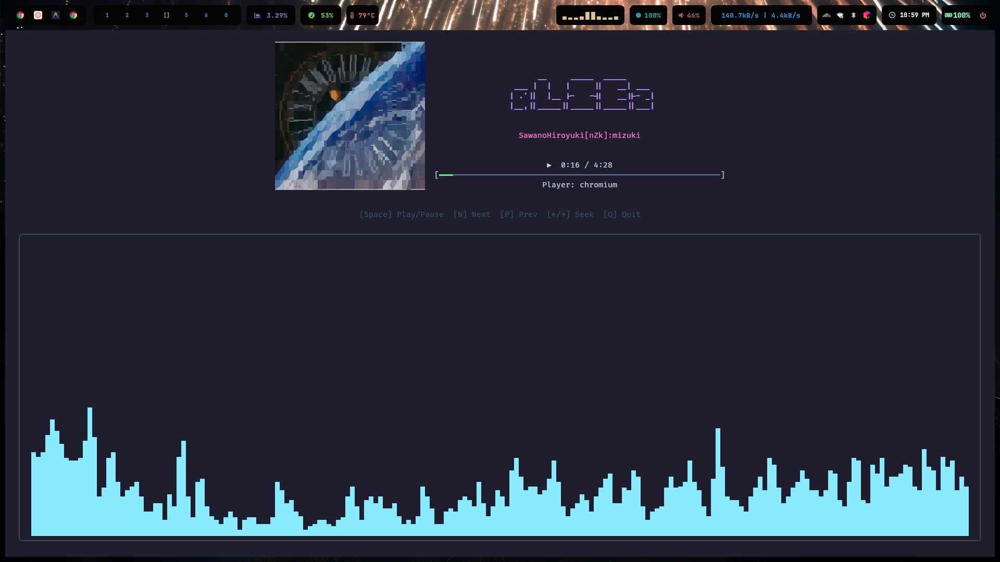

# beautyctl

> Built while trying antigravity and I haven't written a single line of code in this 😭, even commits are done by antigravity

beautyctl is a beautiful, responsive terminal-based MPRIS controller and music visualizer. It provides a clean TUI interface for controlling your music player while visualizing audio and displaying cover art.




## Features

- **MPRIS Control**: Works with Spotify, VLC, mpv, and other players via `playerctl`.
- **Audio Visualizer**: Integrated `cava` visualizer with smooth, multi-line rendering.
- **Cover Art**: Supports high-resolution cover art rendering using `chafa` or `jp2a` (ASCII).
- **Responsive Layout**: Adapts automatically to terminal window size.
- **Dynamic Styling**: Centered layout with ASCII art titles.

## Prerequisites

Before running beautyctl, ensure you have the following installed on your system:

- **playerctl**: For controlling media players.
- **cava**: For audio visualization data.
- **chafa**: (Optional) For the default high-resolution cover art.
- **jp2a**: (Optional) For ASCII/JPEG cover art mode.

On Debian/Ubuntu:
```bash
sudo apt install playerctl chafa jp2a
# cava usually requires building from source or adding a PPA/repo
```

On Arch Linux:
```bash
sudo pacman -S playerctl cava chafa jp2a
```

## Installation

Clone the repository and build the binary:

```bash
git clone https://github.com/n1ved/beautyctl.git
cd beautyctl
go build -o beautyctl .
```

## Usage

Run the application:

```bash
./beautyctl
```

### Cover Art Modes

You can specify the cover art renderer using the `--cover` flag:

- **chafa** (Default): Uses `chafa` to render symbols and block characters. Best quality.
- **jp2a**: Uses `jp2a` to render colored ASCII text.
- **none**: Disables cover art rendering.

Examples:

```bash
./beautyctl --cover chafa
./beautyctl --cover jp2a
./beautyctl --cover none
```

## Controls

- **Space**: Play / Pause
- **N**: Next Track
- **P**: Previous Track
- **Left Arrow**: Seek Backward (5s)
- **Right Arrow**: Seek Forward (5s)
- **Q**: Quit Application

## Troubleshooting

- **No audio visualizer**: Ensure `cava` is installed and configured correctly. beautyctl creates a temporary config for cava to output to raw mode.
- **Cover art not showing**: Ensure `chafa` or `jp2a` is installed in your system PATH. Check the logs (`beautyctl.log`) for errors.
- **Lag**: The application caches ASCII art generation to minimize CPU usage. If you experience lag, try resizing the window to force a refresh.
